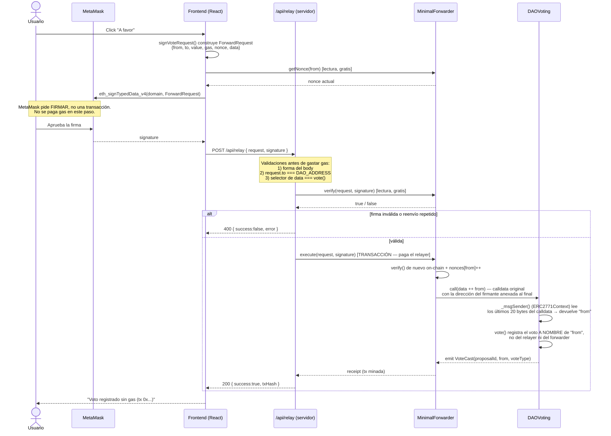
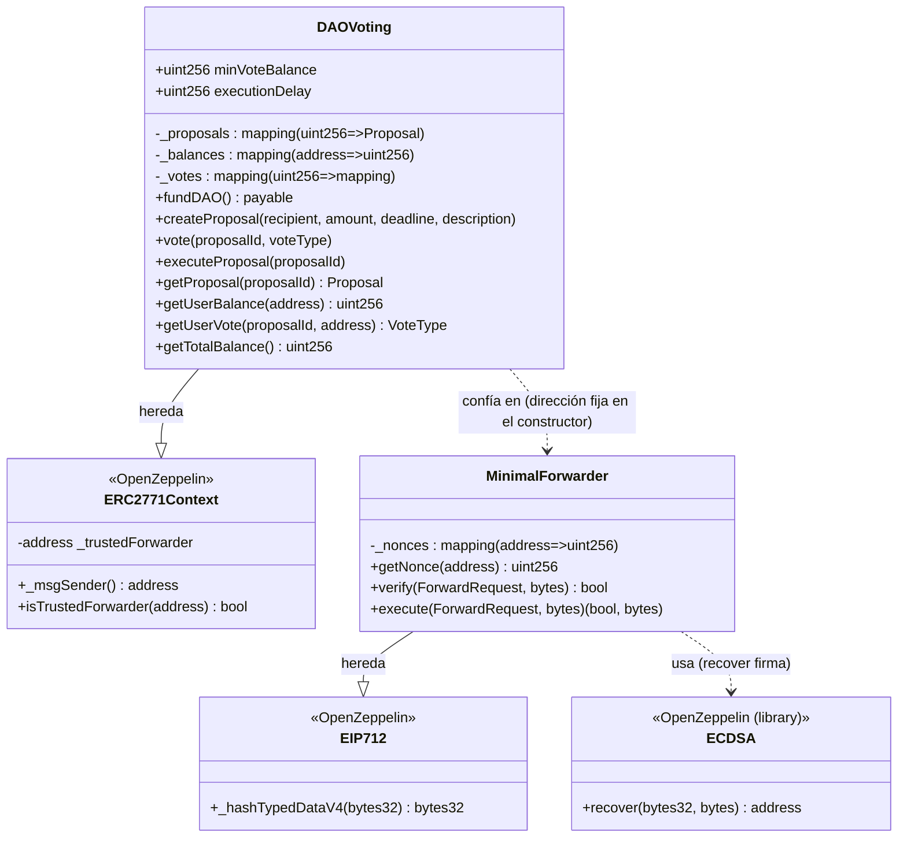
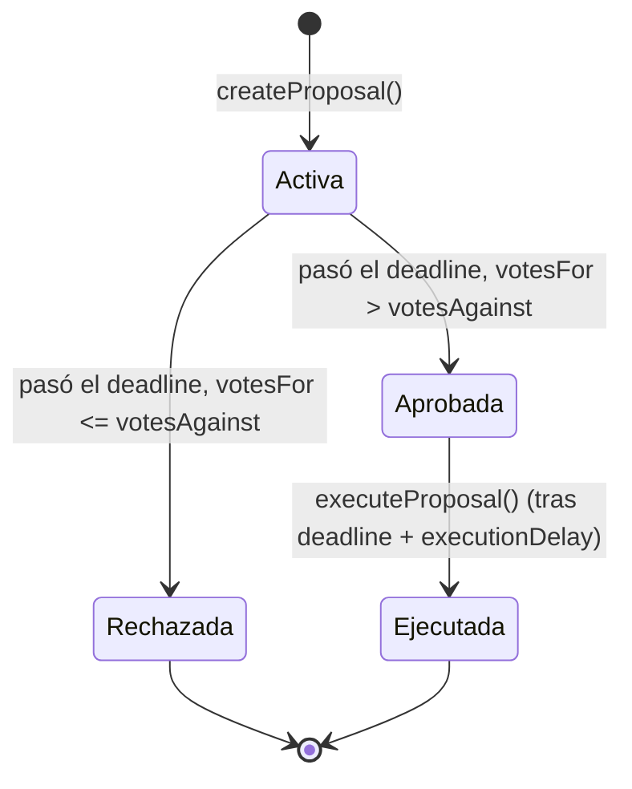
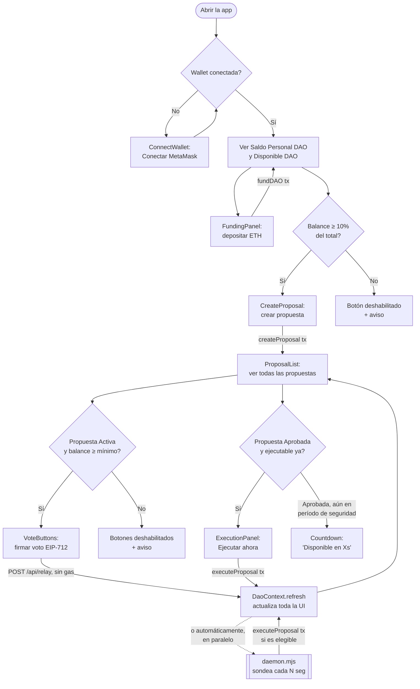
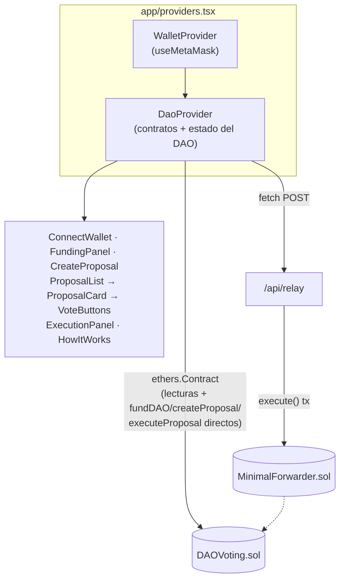

# Arquitectura — DAO Gasless

Este documento detalla cómo está construido el sistema: el flujo completo de una meta-transacción (voto sin gas), la arquitectura de los contratos, el flujo de uso en el frontend, y el stack tecnológico usado en cada capa. Para instalación y comandos, ver [`README.md`](README.md).

## 1. Flujo de meta-transacciones

Votar no cuesta gas para el usuario porque no envía ninguna transacción: firma un mensaje off-chain (EIP-712) y un **relayer** (la API `/api/relay`, corriendo en el backend de Next.js) es quien efectivamente manda la transacción on-chain y paga el gas, a través del contrato `MinimalForwarder` (EIP-2771).

**Puntos clave:**

- `MinimalForwarder.execute()` no restringe quién lo llama — cualquiera con un `(request, signature)` válido puede enviarlo. En este proyecto ese "cualquiera" es siempre `/api/relay`, pero el mismo mecanismo permitiría que el propio firmante enviara su request y pagara su gas, sin cambiar nada del contrato.
- El relayer (`/api/relay`) es deliberadamente **restringido**: solo reenvía llamadas dirigidas al contrato del DAO y cuyo selector sea `vote(uint256,uint8)` — no es un relayer abierto a cualquier llamada arbitraria.
- El `nonce` por firmante evita reenvíos (replay): una vez usado un `(request, signature)`, `MinimalForwarder` lo rechaza si se intenta de nuevo.

## 2. Arquitectura de contratos

`DAOVoting` no importa ni llama directamente a `MinimalForwarder` — la relación es de **confianza configurada**: al desplegar, se le pasa la dirección del forwarder al constructor (`ERC2771Context(trustedForwarder)`), y desde ese momento `DAOVoting` trata cualquier llamada que venga de esa dirección como un "reenvío", extrayendo el firmante real del calldata en vez de usar `msg.sender` directamente.

### Estados de una propuesta

El contrato no guarda un campo "estado" — se deriva de `deadline`, `executionDelay`, los contadores de voto y el flag `executed`:

Mientras está "Activa", cada llamada a `vote()` puede cambiar el voto de un miembro (se descuenta el voto anterior y se aplica el nuevo). Una vez pasado el deadline, `vote()` deja de aceptar nuevos votos — el resultado (Aprobada/Rechazada) queda fijo, y solo falta que se cumpla `executionDelay` para poder ejecutar.

## 3. Flujo de usuario en frontend

### Cómo se comparte el estado (contexts)

`WalletContext` expone la conexión MetaMask (dirección, signer, red). `DaoContext`, anidado dentro, arma las instancias de `Contract` (ethers) con ese signer, expone balances/propuestas/log de ejecución, y las acciones (`fundDAO`, `createProposal`, `voteGasless`, `executeProposalManually`). Todos los componentes leen y escriben a través de `useDao()`/`useWallet()` — ninguno llama a los contratos directamente.

## 4. Stack Tecnológico Detallado

### Contratos (`sc/`)

| Capa | Tecnología | Versión | Propósito |
|---|---|---|---|
| Lenguaje | Solidity | `^0.8.24` | Contratos `DAOVoting` y `MinimalForwarder` |
| Toolkit | [Foundry](https://book.getfoundry.sh/) (forge / cast / anvil) | forge 1.7.1 | Compilar, testear, desplegar, nodo local |
| Librerías | [OpenZeppelin Contracts](https://docs.openzeppelin.com/contracts/) | 5.6.1 | `ERC2771Context`, `EIP712`, `ECDSA` |
| Testing | `forge-std` (`Test.sol`) | — | 28 tests (`DAOVoting.t.sol`, `MinimalForwarder.t.sol`) |
| Optimizador | solc optimizer | 200 runs | Configurado en `foundry.toml` |

### Frontend (`web/`)

| Capa | Tecnología | Versión | Propósito |
|---|---|---|---|
| Framework | [Next.js](https://nextjs.org/) (App Router) | 15.5.20 | Páginas, layout, API routes, build (Turbopack) |
| UI | React | 19.1.0 | Componentes de la interfaz |
| Lenguaje | TypeScript | `^5` | Tipado de contratos, props, estado |
| Web3 | [ethers.js](https://docs.ethers.org/v6/) | `^6.17.0` | `BrowserProvider`, firma EIP-712, llamadas a contratos |
| Estilos | Tailwind CSS | `^4` | Paleta, layout responsivo, componentes |
| Linting | ESLint + `eslint-config-next` | `^9` / 15.5.20 | Calidad de código |

### Backend del frontend / infraestructura

| Pieza | Tecnología | Propósito |
|---|---|---|
| Relayer | API Route de Next.js (`app/api/relay`), runtime `nodejs` | Valida y reenvía meta-transacciones, paga el gas con la wallet del relayer |
| Herramienta de demo | API Route (`app/api/dev/advance-time`) | Adelanta el reloj de Anvil (`evm_setNextBlockTimestamp`) — solo funciona en local |
| Daemon | Script Node.js standalone (`scripts/daemon.mjs`) | Sondea y ejecuta propuestas aprobadas automáticamente, fuera del proceso de Next.js |
| Nodo de desarrollo | Anvil (Foundry) | Blockchain local para desarrollo y pruebas (chain id `31337`) |
| Wallet | MetaMask (extensión) | Firma de meta-transacciones y transacciones normales |
